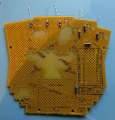

# Cowboys vs Dinosaurs Badge Kit Assembly Instructions

Welcome to the Cowboys vs Dinosaurs Badge kit assembly instructions.

This page will detail what comes in the badge kit and step by step instructions to build your badge. 

-- [@alt_bier](https://twitter.com/alt_bier)  - [My Contact Info](https://gowen.net/about)

## Badge Distribution Packages

The badges have been distributed in two different packages

* KIT - This is a kit that requires DIY soldering/assembly of all components
* ASS - This is a Fully Assembled ready to wear badge

## Component List

This is the list of components that are provided in the kit

* Main Kit Bag (20x30cm-8x12in Holographic) Containing:
  * 1x PCB panel (which breaks apart for top/front and bottom/rear PCBs) Note: The PCB might have broken apart during shipping, but this is not a problem as its required for assembly.
  * Small Component Bag #1 (4x5cm-1.5x2in Clear) Containing:
    * 4x Brass10mm Standoff and 2x M3 Screw set
  * Small Component Bag #2 (5x7cm-2x2.8in Red) Containing:
    * 1x Lipo Battery 103040
    * 1x JST mini PH Connector Wire
    * 2x Rubber Band Size #8 (1 req. 1 spare)
  * Small Component Bag #3 (8x8cm-3x3in Clear) Containing:
    * 1x Lanyand
  * Small Component Bag #4 (6x9cm-2.4x3.5in Mylar) Containing:
    * 1x ESP32 WeMos Lolin32 Dev Board
    * 2x Header Male 2.54mm 1x13 Pin Strip
  * Small Component Bag #5 (8x12cm-3.2x4,7in Mylar) Containing:
    * 6x WS2812D 5mm 4-Pin Addressable Neopixel LED
    * 2x White 3mm 2-pin LED
    * 2x Red 3mm 2-pin LED
    * 2x Blue 3mm 2-pin LED
    * 6x 100nF Ceramic Disc Capacitor
    * 8x 47 Ohm 6.2mm Metal Film Resistor
    * 1x SS12D00 3-Pin SPDT Right Angle Switch
    * 2x Header Male 2.54mm 1x2 Pin Right Angle Strip
  * 2x Sticker (Not Required for badge Assembly)

## Assembly Steps

* Break apart the PCBs on the mouse bites
  * To provide an even break line placing one PCB on a hard surface (like a desk) and pushing down on the other PCB works well
  * Break off the mouse bites from the PCB(s) that they are still attached to
  * Mini pliers are helpful but not required
  * The rough edges can be filed or sanded down if a smooth edge is preferred

* Resistors
  * The eight 47-Ohm resistors are labeled R1-R6, R10 and R20
  * Resistors are non-polar so they can be placed in either direction.
  * Place all the resistors into the PCB bending thier legs outward to hold them in place
  * Solder all 16 resistor connections (both ends of the 8 resistors)
  * When cooled cut the component legs off at the top of the solder joints (do not cut into the solder joint)

* One Color 3mm 2 pin LEDs
  * The six traditional one color 2 pin LEDs are easy to solder but they need to be bent over for specific positioning on the PCB so be careful with placement
  * D4 & D6 - These are 3mm 2-pin RED LEDs
    * Place the LEDs in thier designated places on the PCB folding them over then bending legs out to hold in place
    * Make sure to align the LEDs properly using the silk guide to place short leg in square hole, folding the LEDs in the direction indicated to place the body of the LED over the solder mask void on the PCB
    * Solder all the LED connections
    * When cooled cut the component legs off at the top of the solder joints (do not cut into the solder joint)
  * D3 & D5 - These are 3mm 2-pin BLUE LEDs
    * Place the LEDs in thier designated places on the PCB folding them over then bending legs out to hold in place
    * Make sure to align the LEDs properly using the silk guide to place short leg in square hole, folding the LEDs in the direction indicated to place the body of the LED over the solder mask void on the PCB
    * Solder all the LED connections
    * When cooled cut the component legs off at the top of the solder joints (do not cut into the solder joint)
  * D1 & D2 - These are 3mm 2-pin WHITE LEDs
    * Place the LEDs in thier designated places on the PCB folding them over then bending legs out to hold in place
    * Make sure to align the LEDs properly using the silk guide to place short leg in square hole, folding the LEDs in the direction indicated to place the body of the LED over the solder mask void on the PCB
    * Solder all the LED connections
    * When cooled cut the component legs off at the top of the solder joints (do not cut into the solder joint)

* Addressable Neopixel 5mm 4-Pin LEDs
  * The six Neopixel LEDs are a bit more difficult to solder given the pins are close together and they need to be bent over for specific positioning on the PCB so be careful with placement
  * D10, D11 & D12
    * Place the LEDs in thier designated places on the PCB folding them over then bending legs out to hold in place
    * Make sure to align the LEDs properly using the silk guide to place longest leg one position over from the square hole, folding the LEDs in the direction indicated to place the body of the LED over the solder mask void on the PCB
    * Solder all the LED connections
    * When cooled cut the component legs off at the top of the solder joints (do not cut into the solder joint)
  * D20, D21 & D22
    * Place the LEDs in thier designated places on the PCB folding them over then bending legs out to hold in place
    * Make sure to align the LEDs properly using the silk guide to place longest leg one position over from the square hole, folding the LEDs in the direction indicated to place the body of the LED over the solder mask void on the PCB
    * Solder all the LED connections
    * When cooled cut the component legs off at the top of the solder joints (do not cut into the solder joint)

* Capacitors
  * The six capacitors are tan colored 2.5mm wide 2 pin 100nF non-polar ceramic disc capacitors (that look like Ibuprofen tablets) which are labeled C10-12, C20-22
  * Place all the capacitors in thier designated places on the PCB bending legs out to hold in place
  * These are non-polar so they can be placed in either direction.
  * Solder all the capacitor connections
  * The large ground plane makes one of the pins take a bit longer to heat up and the thin legs and larger pads make for uneven heating.  So, take a little more time to make sure these have a good connection.
  * When cooled cut the component legs off at the top of the solder joints (do not cut into the solder joint)

* Switch for battery power
  * The battery power switch is a 3-pin SPDT switch with a 5mm lever and right angle pins
  * Place the switch in its designated place on the PCB with the lever pointing towards the PCB edge. 
  * You might need to tilt it a bit to allow the pins to stick through the PCB enough to easily solder them.
  * Solder all the switch connections

* Battery Holder Right Angle Male Headers
  * The 2.54mm 1x2 Pin Right Angle Male Headers are used with a rubber band to secure the lipo battery and are labeled J2 and J3 on the PCB
  * Place the short side of the header pins into the designated positions on the PCB with the long side pointing away from where the battery will be placed later.
  * Solder all the connections
  * It may be tricky to solder them while keeping them from pressing against the PCB, try soldering only one pin then adjust the header while applying heat to that pin

* The ESP32 development board
  * This is a 26 pin ESP32 WeMos Lolin32 development board with two 1x13 pin male header strips
  * You can either solder the male header pins to the ESP32 board first then solder that to the badge PCB or solder the male header pins to the badge PCB first then solder the ESP32 board to those pins
  * In either case we want to have the long ends of the male header pins pointing away from the badge PCB so that we do not need to cut those pins on the front of the badge.
  * Make sure to place the ESP32 in its designated place on the PCB and ensure it is aligned properly according to the silk drawing on the badge PCB (look at the USB and Battery connector symbols drawn in silkscreen)
  * Solder all the connections

* ESP32 Battery Power Wires
  * The ESP32 development board has a JST mini PH battery power connector which needs to be connected to the badge PCB
  * The JST mini PH connector is keyed allowing it to only be plugged in one way
  * You can plug the connector into the ESP32 dev board to measure where to cut these wires to size, do not cut them too short or leave too much slack.
  * Disconnect the connector before attaching and soldering the wires.
  * WARNING: Unfourtunatley the JST mini PH Connector Wires that were available for this project had the red and black wires in the WRONG positions for this ESP32 dev board.
    * This means that the red wire which is usually an idication of Positive power is actually aligned with the Ground/Negative power terminal on the ESP32 dev board and visa versa for the black wire.
    * When connecting these wires to the badge PCB J1 pads you will need to connect the RED TO GND (round pad) and BLACK TO + (square pad)
    * Failure to do this will result in REVERSE POLARITY that will DESTROY the ESP32 dev board.
    * Reminder labels have been attached to these wires as a WARNING
  * Solder the connections
  * When cooled trim any excess wire at the top of the solder joints (do not cut into the solder joint)
  * Verify that the connector can reach to be plugged into the ESP43 dev board (you might need to twist the connector around to line it up)
  * Be sure to disconnect this connector since we do not want it connected when working with the LIPO Battery

* LIPO Battery
  * The LIPO Battery has a charge so you need to be careful when working with it
    * Make sure not to touch the battery wires together by only stripping and soldering one wire at a time
    * Make sure battery power will not be applied to the badge by ensuring the ESP32 battery connector is disconnected and the badge switch is in the off position (towards the center of the badge)
  * Strip the tip of the BLACK battery wire and insert it into BT1 on the badge PCB in GND (round pad)
  * Solder this wire to the PCB
  * Strip the tip of the RED battery wire and insert it into BT1 on the badge PCB in + (square pad)
  * Solder this wire to the PCB
  * Place the battery onto the PCB within the designated square drawn in silk on the PCB
  * Attach a rubber band over the battery between the male header pins in J2 and J3
  * Plug in the ESP32 battery connector

* Testing
  * Turn on the badge and make sure all the LEDs light up
  * If any of them do not then turn the badge off, make any necessary corrections and try again.
  * Turn the badge off when done before connecting the two PCBs

* Connect Both PCBs using Standoffs and M3 Screws
  * On the rear badge PCB (the one with no components) attach a brass 10mm standoff using a brass M3 screw in each of the four drill holes in that PCB making them reasonably tight (over tightening might crack the PCB)
  * Align the front and rear PCBs and on the front PCB insert the brass screws into the PCB and standoff connecting the two PCBs, but keep them only loosly connected at first
  * Check that the battery wires are fully clear of the standoffs as you tighten each of the four M3 screws on the front PCB making them reasonably tight (over tightening might crack the PCB)

* Enjoy!
  * Attach the lanyard and enjoy your new creation.
