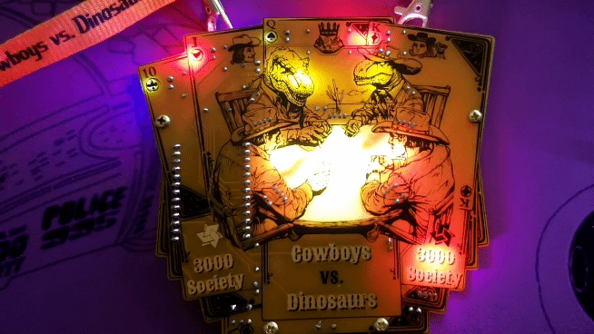
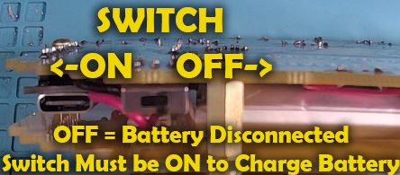

# Cowboys vs Dinosaurs Badge

Welcome to the Cowboys vs Dinosaurs Badge website.

This badge was designed for the 3000 Society conference in May 2024.
It will also be made available at the DEFCON 32 conference in Aug 2024.

The theme was based on the 3000 Society conference theme of "Cowboys vs Dinosaurs".
Since this is a gaming conference I thought it was apppropriate to have them facing off at a card game with a playing card background.

On this page you will find all the details about this badge including an operations guide, an assembly guide (for those building the badge from a kit), and a detailed review of the art and cicuit design and pcb design.

-- [@alt_bier](https://twitter.com/alt_bier)  - [My Contact Info](https://gowen.net/about)

---

# Badge Operations

Here are the basics for operating the badge.

## Power Switch and Battery Charging

This badge uses an ESP32 Development board with a USB-C connector that is connected to and powered by a LIPO rechargeable battery.

The power switch on the badge is a direct cutoff to the LIPO battery.
So the switch must be in the ON position in order to charge the battery from the dev board.

The switch is in the OFF position when it is closer to the battery.

To charge the battery follow these steps:
* Turn the power switch to ON which will power on the badge if the battery has any charge remaining.  But, even if the badge does not power on the switch should be in the ON position. 
* Plug in a USB-C cable to the badge dev board and apply power either from a PC or wall charger. 
* On the back of the badge you should see the battery charge indicator light lit up.  If it is not then repeat the first two steps to try again.  This indicator light should flash if it does not see a battery connected and will turn off when a connected battery is fully charged. 
* It should take about 3 to 4 hours to fully charge a battery from fully discharged at which point the battery charge indicator light will turn off.
* Since it can be annoying to have the badge flashing all its LEDs while charging we added a LED-Off mode that can be activated by pressing on the logo button for a long press of about 20 seconds. 
* In the LED-Off mode all the badge LEDs will turn off except for the two on the ESP dev board.  The battery charge indicator light should be on if it charging and the on-board LED will flash once every 20 seconds or so.  The flashing LED is there to tell you the badge is still powered on even if the charge is done and the charge light turns off. This LED mode can be disabled by long pressing the logo again or by power cycling the badge (including disconnecting the USB) 

## Touching Cowboys - Flush Game

Pressing the word "Cowboys" will light up the two cowboys faces for a few seconds before returning to the default LED mode. 

Holding a long press of 20 seconds on the word "Cowboys" will enter the Flush game mode.
This is a simple game that will light the five LEDs in the table area with different colors each time you press "Cowboys" and it will keep them all lit if all five LEDs have matching colors indicating you got a flush and won.  This LED mode can be disabled by long pressing "Cowboys" again or by power cycling the badge. 

## Touching Dinosaurs - Reaction Game

Pressing the word "Dinosaurs" will light up the two dinosaurs faces for a few seconds before returning to the default LED mode. 

Holding a long press of 20 seconds on the word "Dinosaurs" will enter the Reaction Time game mode.
This is a simple game that turn on each of the four card LEDs one at a time before turning them off again.  Pressing "Dinosaurs" will stop the LEDS in thier current positions for a few seconds.  The goal of the game is to try to stop it with all four LEDs lit. This LED mode can be disabled by long pressing "Dinosaurs" again or by power cycling the badge. 

## Touching 3000

Pressing the word "3000" will flash the center lights briefly in a boop effect.
This was added in code revision 2 so if this does nothing then you are running an older code version.

## Touching Society - Adventure Game

Pressing and holding the word "Society" for a long press of 20 seconds you will enter the Adventure game.
This will light the status LED red and then spin up a wireless access point with the name "cvd-badge-<MAC>" and a web server on 192.168.1.31
Connect to the access point which is open and does not require a password, then browse http://192.168.1.31 to start the adventure.
This is a simple choose your own adventure game.
This was added in code revision 2 so if this does nothing then you are running an older code version.

# Details

Detailed Information about the project will be posted here soon.

# Assembly Instructions

Assembly Instructions will be posted here soon.
